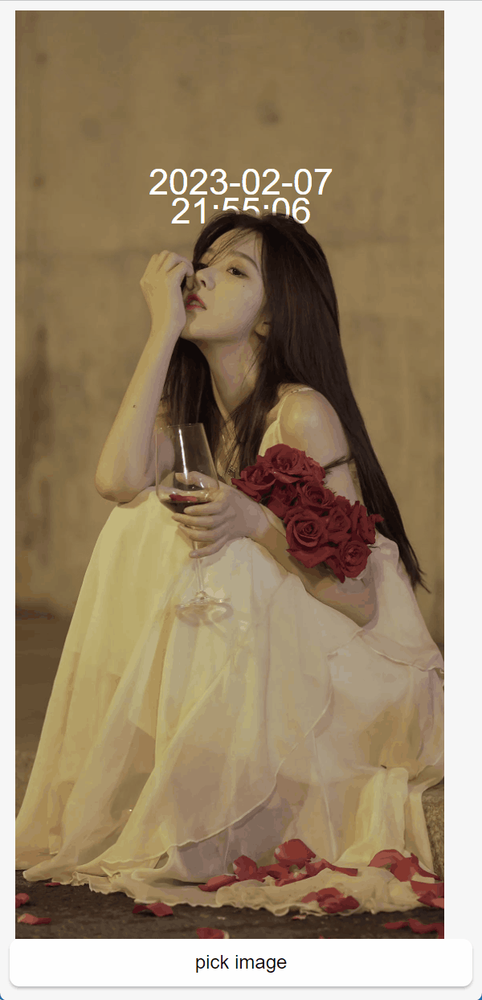

# rust-deep-field-demo

这是一个类似于 `ios16` 景深壁纸效果的 `Demo`

## 支持

 * 跨平台
 * 视图层基于js 易修改
 * 本地化 0线上依赖

## 基本思路

1. 基于 `MiDaS` 分析图片景深
2. 基于得到的景深灰度图分割出`N`份透明图片
3. 最后把小组件和不同层的图片组合到一起

## 依赖项

 * rust
 * javascript
 * [tch](https://github.com/LaurentMazare/tch-rs)
 * [opencv](https://github.com/twistedfall/opencv-rust)
 * [MiDaS](https://github.com/isl-org/MiDaS)
 * [tauri](https://tauri.app/)

